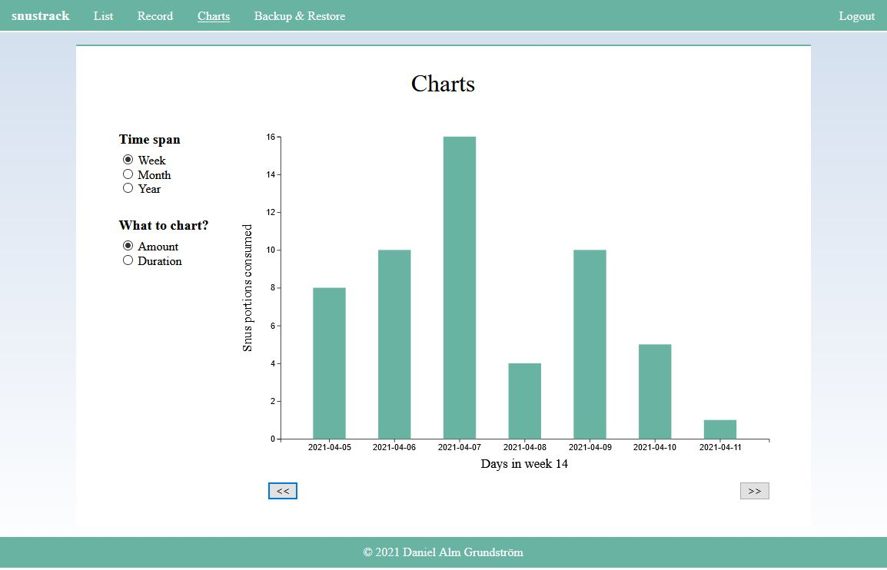
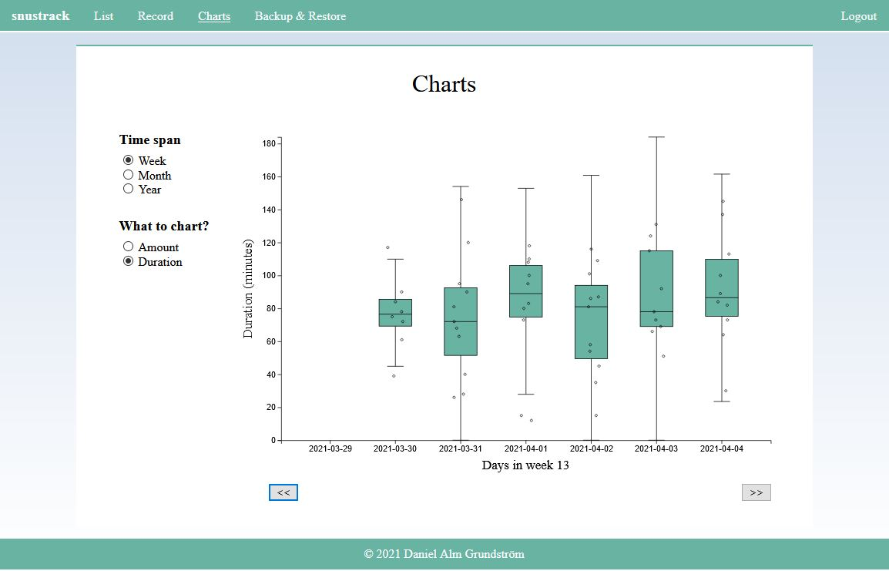

# snustrack

Self-hosted web app for recording and visualizing your consumption of Snus.

## Screenshots





## Setup

Coming soon. See [Development Setup](#development-setup) for running locally.

## Development Setup

1. Create `server/src/main/resources/application.properties` with the following content:

   ```
   spring.datasource.url = jdbc:h2:file:./data/data
   spring.datasource.username = <DATABASE USERNAME>
   spring.datasource.password = <DATABASE PASSWORD>
   spring.datasource.driverClassName = org.h2.Driver
   spring.jpa.database-platform = org.hibernate.dialect.H2Dialect
   spring.jpa.hibernate.ddl-auto = update
   spring.security.user.name = <DEFAULT USER USERNAME>
   spring.security.user.password = <DEFAULT USER PASSWORD>
   spring.security.user.roles = manager
   server.servlet.session.timeout=30d
   server.servlet.session.cookie.max-age=30d
   snustrack.js.uri = http://localhost:8081/snustrack.js
   snustrack.css.uri = http://localhost:8082/snustrack.css
   ```

   - `<DATABASE USERNAME>` -- username to use for the database.
   - `<DATABASE PASSWORD>` -- password to use for the database.
   - `<DEFAULT USER USERNAME>` -- username for accessing the website.
   - `<DEFAULT USER PASSWORD>` -- password for accessing the website.

2. Run `docker-compose -f docker-compose.dev.yml up -d` from the repo root directory.
3. Wait a minute for everything to build, then access the website at http://localhost:8080 using the username and password specified in `application.properties`.
